# Architecture Visuals

Here are the visualized structures of the system.

````carousel
## 1. Component Relationship (Domain Layering)
The system is composed of two main business domains. **Payroll** sits on top of **CoreHR**.

```mermaid
flowchart LR
    %% Nodes
    CoreHR("🔷 CoreHR Component<br/>(Base Domain)"):::core
    Payroll("🔶 Payroll Component<br/>(Derived Domain)"):::payroll

    %% Relationship
    Payroll == "Depends on\n(Shared Kernel)" ===> CoreHR

    %% Styling
    classDef core fill:#e1f5fe,stroke:#0277bd,stroke-width:2px,color:#01579b,rx:10,ry:10;
    classDef payroll fill:#fff3e0,stroke:#ef6c00,stroke-width:2px,color:#e65100,rx:10,ry:10;
    
    linkStyle 0 stroke:#b0bec5,stroke-width:3px;
```



> [!NOTE]
> **CoreHR** is the stable foundation defining "Who" and "Where".
> **Payroll** is the business layer that uses those definitions to calculate "How much".
<!-- slide -->
## 2. Hexagonal Internal Structure
How data flows inside a single component using the Ports and Adapters pattern.

```mermaid
flowchart LR
    %% External Actors
    Client([👤 Client / Web]):::actor
    DB[("🗄️ Database")]:::db

    %% Adapters (Outside)
    API["Input Adapter<br/>(api module)"]:::adapter
    Repo["Output Adapter<br/>(repository-jdbc)"]:::adapter

    subgraph Hexagon [" Application Hexagon "]
        direction TB
        
        %% Internal Layers
        Service["Application Service<br/>(service module)"]:::app_layer
        Port{{"Output Port<br/>(infrastructure module)"}}:::port_layer
        Model(["Domain Box<br/>(model module)"]):::domain_layer
        
        %% Internal Dependencies
        Service --> Port
        Service --> Model
        Port -.-> Model
        
        %% Layer Styling
        classDef app_layer fill:#fff8e1,stroke:#ffa000,stroke-width:2px,color:#e65100;
        classDef port_layer fill:#fff3e0,stroke:#ffb74d,stroke-width:1px,stroke-dasharray: 5 5,color:#ef6c00;
        classDef domain_layer fill:#e8f5e9,stroke:#43a047,stroke-width:2px,color:#1b5e20;
    end

    %% Flow connections
    Client ==> API
    API --> Service
    
    %% Dependency Inversion
    Repo -.->|Implements| Port
    Repo --> DB

    %% Styling Elements
    classDef actor fill:#f3e5f5,stroke:#ab47bc,stroke-width:2px,color:#4a148c;
    classDef db fill:#eceff1,stroke:#546e7a,stroke-width:2px,color:#263238;
    classDef adapter fill:#e0f2f1,stroke:#009688,stroke-width:2px,color:#004d40,rx:5,ry:5;
    
    style Hexagon fill:#fafafa,stroke:#eeeeee,stroke-width:2px
```



> [!TIP]
> **Clarified Layers:**
> *   **Service (Application Layer):** Orchestrates the workflow.
> *   **Model (Domain Layer):** Pure business rules and state.
> *   **Infrastructure (Port Layer):** Interfaces for external communication.
<!-- slide -->
## 3. Application Assembly (Composition)
How the modules are glued together to run.

```mermaid
flowchart TD
    %% Main Node
    App([🚀 application-api<br/>(Bootstrap)]):::boot

    %% Modules
    Web["Web API"]:::mod
    Logic["Business Service"]:::mod
    DB_Impl["DB Implementation"]:::mod

    %% Connections
    App -->|Assembles| Web
    App -->|Assembles| Logic
    App -->|Injects| DB_Impl

    %% Styles
    classDef boot fill:#212121,stroke:#000,stroke-width:2px,color:#fff,rx:10,ry:10;
    classDef mod fill:#f5f5f5,stroke:#bdbdbd,stroke-width:1px,color:#424242,rx:5,ry:5;
    
    linkStyle default stroke:#bdbdbd,stroke-width:2px;
```
> [!IMPORTANT]
> `application-api` is the "Main" function. It sees everything and wires the **DB Implementation** into the **Business Service**.
````
